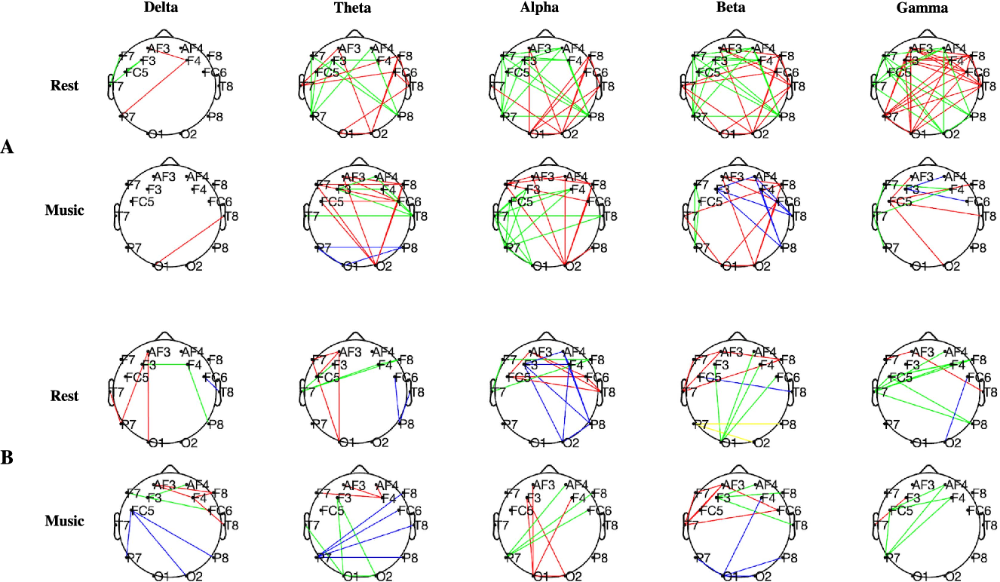
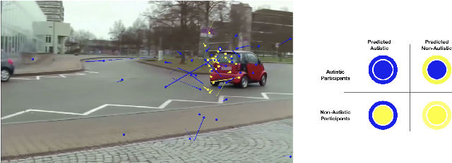
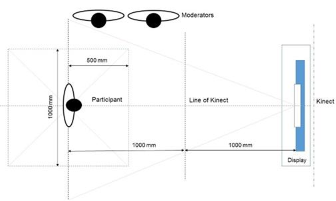
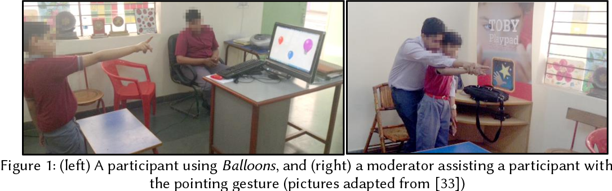
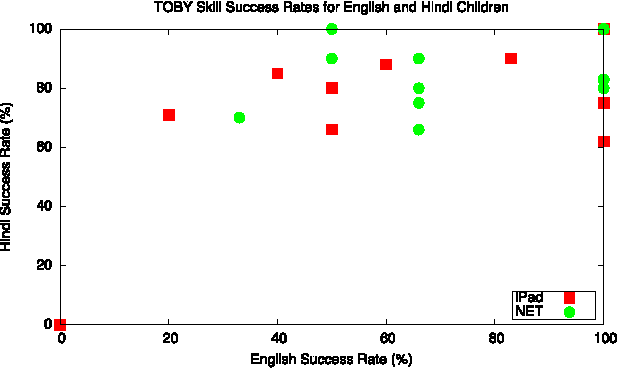

# Blessin Varkey

1. [About Me](https://blessinvarkey.github.io/)
2. **Research**
3. Projects
  - Accessibility Projects
  - Computer Vision Project 
  - Machine Learning Project

### Research (Selected)
For the full list of papers you can visit my [Google Scholar](https://scholar.google.co.in/citations?user=LyH1LVAAAAAJ&hl=en) or [dblp profile](https://dblp.org/pid/176/4218.html). 

### [Functional Brain Connectivity Analysis in Intellectual Developmental Disorder during Music Perception](https://ieeexplore.ieee.org/abstract/document/9201163/)

**Abstract**

> Intellectual Developmental Disorder (IDD) is a neurodevelopmental disorder involving impairment of general cognitive abilities. This disorder impacts the conceptual, social, and practical skills adversely. There is a growing interest in exploring the neurological behavior associated with these disorders. Assessment of functional brain connectivity and graph theory measures have emerged as powerful tools to aid these research goals. The current research contributes by comparing brain connectivity patterns of IDD individuals to those typical controls. Considering the intellectual deficits linked to the IDD population, we hypothesized an atypical connectivity pattern in the IDD group. Brain signals were recorded by a dry-electrode Electroencephalography (EEG) system during the rest and music states observed by the subjects. We studied a group of seven IDD subjects and seven healthy controls to understand the connectivity within the human brain during the resting-state vis-à-vis while listening to music. Findings of this research emphasize (1) hyper-connected functional brain networks and increased modularity as potential characteristics of the IDD group, (2) the ability of soothing music to reduce the resting state hyper-connected pattern in the IDD group, and (3) the effect of soothing music in the lower frequency bands of the control group compared to the higher frequency bands of the IDD group. 

### [Gaze-based Screening of Autistic Traits for Adolescents and Young Adults using Prosaic Videos](https://dl.acm.org/doi/abs/10.1145/3378393.3402242)

**Abstract**

> Autism Spectrum Disorder (ASD) is a universal and often lifelong neuro-developmental disorder. Individuals with ASD often present comorbidities such as epilepsy, depression, and anxiety. In the United States, in 2014, 1 out of 68 people was affected by autism, but worldwide, the number of affected people drops to 1 in 160. This disparity is primarily due to underdiagnosis and unreported cases in resource-constrained environments. Wiggins et al. 1 found that, in the US, children of color are under-identified with ASD. Missing a diagnosis is not without consequences; approximately 26% of adults with ASD are under-employed, and are under-enrolled in higher education.

### [Designing gesture-based applications for individuals with developmental disabilities: guidelines from user studies in India](https://dl.acm.org/doi/abs/10.1145/3161710)

**Abstract**

> Gesture interaction provides a multitude of benefits to individuals with developmental disabilities, from enhancing social, motor and cognitive skills to providing a safe and controlled environment for simulating real-world scenarios. As gesture-based applications gain ground in the special education domain, we study their potential in the Indian context. Together with Tamana, an NGO in New Delhi, we have been conducting a series of exploratory user studies since October 2013. This includes the design and evaluation of three gesture-based applications to impart social and life skills to individuals with developmental disabilities. The Kirana application employs socially appropriate gestures to teach the life skill of buying day-to-day items from a local Indian grocery. Balloons promotes joint attention skills through collaborative interaction. HOPE improves motor coordination and social and cognitive skills, with increasing levels of difficulty. Based on studies with these applications, this article presents guidelines for designing gesture-based applications for individuals with developmental disabilities. The guidelines focus on (a) designing applications that cater to a larger group of individuals to encourage collaboration and inclusion, for instance, providing easy and controllable transitions between different task levels, and balancing interaction and content complexity; (b) addressing the challenges in conducting research in this domain, with respect to ethical and procedural decisions; and (c) designing for technology acceptance within the Indian context, for example, by following a collaborative and stakeholder inclusive approach, and addressing apprehensions towards technology adoption. These guidelines aim to benefit other practitioners working in this domain and especially in the educational technology context of India.

### [Promoting joint attention with computer supported collaboration in children with autism](https://dl.acm.org/doi/abs/10.1145/2982142.2982166)

**Abstract**

> There exists mounting evidence in favor of computer supported autism interventions at the individual level. However, the potential benefits of using computer supported collaboration to encourage social interactions between individuals with autism and typically developed individuals are underexplored, particularly in developing regions. We present an exploratory study of a collaborative gesture-based application, Balloons. The application encourages joint attention, which is defined as the shared attention between two individuals towards the same object. Using mixed methods, we evaluated Balloons for three weeks in New Delhi with ten medium-low functioning autistic children. Our findings suggest that employing CSC interventions for children with autism in India provide (a) observable improvements in social interaction with typically developed peers, (b) the opportunity to customize and individualize intervention to cater to a large spectrum of children and (c) the potential opportunity of reducing fears of certain objects.

### [Computer assisted autism interventions for india](https://dl.acm.org/doi/abs/10.1145/3010915.3011007)

**Abstract**

> Early intervention is critical for children with autism. To provide affordable computer assisted therapies for developing countries, we construct infrastructures for translating and adapting early intervention programs such as TOBY to an Indian context. A Hindi prototype is built and two trials are conducted, showing that the technology was accepted and that the children learnt skills using both language versions, with the children using the Hindi prototype achieving slightly better measurable outcomes.

### Contact Me
| Twitter : [@blessinvarkey](https://twitter.com/blessinvarkey)  | LinkedIn:  [linkedin.com/in/blessinvarkey/](https://www.linkedin.com/in/blessinvarkey/)
